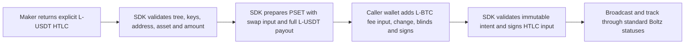

# Plan: Add native Liquid USDt (L-USDT) swaps alongside L-BTC

> Status: **Phases 0–6 implemented on the L-USDT feature branches.** The
> standalone public-SDK regtest matrix is green with runtime pair asset IDs,
> and the atomic route activation migration is committed. Merge remains gated
> on both feature-branch PRs completing CI. Confidential maker HTLCs and
> cooperative MuSig spends remain follow-up work, not part of V1.

## Goal & scope

Add support for **native Liquid Tether (USDt)** as a swappable asset in the
Boltz-v2 Liquid swap engine, alongside the existing L-BTC support, using:

- **Explicit (unconfidential) L-USDT HTLC outputs.**
- **Caller-funded L-BTC network fees** via a **two-stage PSET** boundary.
- **Unilateral tapscript (script-path) claim/refund** for V1 (no cooperative
  MuSig for L-USDT).

This fits both repositories without exposing the maker wallet or redesigning the
Boltz v2 protocol.

> Not RGB-USDT. This plan covers native Liquid USDt only — the Liquid asset
> issued on the Elements chain, not an RGB-issued token.

### Supported swap directions (V1)

- **Submarine:** `L-USDT → BTC Lightning`
- **Reverse:** `BTC Lightning → L-USDT`
- **Atomic chain:** `BTC on-chain → L-USDT`
- Existing BTC / L-BTC behavior remains **unchanged**.



## 1. Frozen protocol decisions (shared SDK/maker contract)

| Concern | V1 decision |
|---|---|
| Maker HTLC output | Explicit / unconfidential L-USDT |
| Payout output | May be confidential |
| Elements transaction fee | Always policy asset (normally L-BTC) |
| Fee payer for SDK claim/refund | Caller wallet |
| Transaction interchange | Base64 PSET |
| Cooperative claim/refund | **Disabled** for L-USDT |
| Spend path | Tapscript claim/refund leaves |
| API shape | Boltz v2 with optional asset extensions |
| Internal maker pair IDs | Private implementation detail |

## Repository split

- **Maker** (`kaleidoswap-maker-rs`): §2, §4, §5, §8, §9, §10, §11.
- **SDK** (`kaleidoswap-sdk`, this repo): §3, §6, §7, plus binding regeneration.
- Both: §2 golden vectors, wire JSON contract (§4).

SDK and maker work can proceed in parallel once the wire JSON and golden vectors
are frozen.

---

## 2. Maker: fix script/address compatibility first

The maker currently creates some Liquid reverse and atomic-chain addresses with
the submarine tree and the wrong aggregate-key order; the SDK will correctly
reject those addresses even with otherwise-correct JSON.

| Swap side | Script tree | MuSig aggregation order |
|---|---|---|
| Submarine / deposit | `submarine_swap_tree` | `ClaimFirst` |
| Reverse / server lock | `reverse_swap_tree` | `RefundFirst` |
| Chain user lock | `reverse_swap_tree` claim leaf (32-byte size check) | `ClaimFirst` |
| Chain server lock | Same as reverse | `RefundFirst` |

- Add `maker_swap::create_chain_lockup`, backed by `reverse_swap_tree`.
- Reverse Liquid creation (`reverse.rs`): `submarine_swap_tree` → `reverse_swap_tree`.
- Atomic server lock (`chain.rs`): reverse-shaped tree.
- Thread an `AggOrder` field through address construction, claim/refund params,
  provider calls and witness construction (currently hardcoded in `claim.rs`).
- Use `CooperativeKey::from_bytes_reverse` for reverse/server-lock address
  validation.
- Keep the lockup blinder absent (explicit-output architecture in `address.rs`).

**Cross-repo golden vectors** (blocking, before further work): swap tree JSON,
claim/refund leaf scripts and Liquid leaf version `0xc4`, aggregate internal
key, taproot output key, and explicit Elements address. Commit the same fixture
inputs and expected outputs in both repositories; both implementations must
derive identical values from the same keys, preimage hash and timeout.

---

## 3. SDK: separate currency from network

Core design bug: `Chain::Display` (network/mod.rs:20-27) serializes **every**
Liquid network as `"L-BTC"`. A chain identifies the *network*; it cannot also
identify the *asset*.

Add:

```rust
pub enum Currency { Btc, LBtc, LUsdt }
```

Keep `Chain` for network selection. In the UniFFI request records add:

```rust
#[uniffi(default = None)] pub from_currency: Option<Currency>;
#[uniffi(default = None)] pub to_currency: Option<Currency>;
```

Serialization rules:

- `Chain::Bitcoin(_)` permits only `Currency::Btc`.
- `Chain::Liquid(_)` permits `Currency::LBtc` or `Currency::LUsdt`.
- Absent currency preserves current behavior: Bitcoin → `BTC`, Liquid → `L-BTC`.

The raw Boltz request structs keep using strings; only the binding→core
conversion decides which string is sent. L-USDT is additive; old clients are
preserved.

In `boltz.rs` (from line 259):

- Add a defaulted `L-USDT` outer map to submarine pair responses.
- Add `get_lusdt_to_btc_pair()`.
- Add `get_btc_to_lusdt_pair()` to reverse and chain responses.
- Add optional `from_asset_id`, `to_asset_id`, `fee_asset_id` to every pair card.

---

## 4. Boltz v2 wire contract (shared)

Public wire currencies only — never internal pair IDs.

| Swap kind | Internal maker pair | Public route |
|---|---|---|
| Submarine | `L-USDT/BTC@LN` | `L-USDT/BTC` |
| Reverse | `BTC@LN/L-USDT` | `BTC/L-USDT` |
| Chain | `BTC/L-USDT-ATOMIC` | `BTC/L-USDT` |
| Legacy plain send | `BTC/L-USDT` | Hidden from SDK |

Pair cards include optional `fromAssetId`, `toAssetId`, `feeAssetId`. Existing
fee structures must match the SDK exactly:

- Submarine: `minerFees: number`
- Reverse: `minerFees: { lockup, claim }`
- Chain: `minerFees: { server, user: { lockup, claim } }`

Amount semantics are part of the contract:

- `limits` are denominated in input-asset base units.
- `rate` is output-asset base units per input-asset base unit.
- Quoted percentage and miner fees are denominated in output-asset base units.
- `feeAssetId` identifies the policy asset used by the actual Elements fee
  output; it does not change the quote-fee denomination.

Create-response additions:

- Submarine/reverse: optional `assetId`, `feeAssetId`.
- Each `ChainSwapDetails`: optional `assetId`, `feeAssetId`.
- Explicit Liquid lockups omit `blindingKey` or return `null`.
- Keep required compatibility fields (e.g. `bip21`); empty string acceptable for
  explicit Liquid lockups.
- Atomic chain: stop requiring `userAddress` at creation — the payout address
  belongs to transaction construction, not swap creation.

Before implementation, commit canonical JSON fixtures covering all three pair
responses; submarine, reverse and chain create requests/responses; omitted
versus `null` optional fields; the chain request's exactly-one-of
`userLockAmount`/`serverLockAmount` rule; all transaction lookup responses;
`transaction_not_found`; and the complete WebSocket status sequence. Those
fixtures, together with the golden vectors in §2, complete Phase 0 and turn the
frozen architecture into an executable contract.

---

## 5. Maker: inverse quoting for L-USDT submarine

The SDK submarine request does not send `fromAmount`; the maker requires it. Add
`quote_for_output`:

1. Decode invoice → BTC amount.
2. Search within the pair's input limits.
3. Reuse the existing forward quote during search.
4. Return the smallest L-USDT input whose quoted output ≥ invoice amount.
5. Monotone binary search, capped at 64 iterations.
6. Reject when no in-limit amount satisfies the invoice.

Accept legacy `fromAmount` temporarily but require it to equal the canonical
inverse-quoted amount (prevents conflicting caller amounts).

---

## 6. SDK: generalize Liquid scripts & explicit outputs

In `liquid.rs` (from line 75):

- Rename `LBtcSwapScript` → `LiquidSwapScript`, `LBtcSwapTx` → `LiquidSwapTx`;
  keep deprecated type aliases so current Rust users aren't broken.
- Replace mandatory `ZKKeyPair` blinding key with `Option<ZKKeyPair>`.

Address validation (explicit rules):

- Confidential address + matching blinding key → accept.
- Explicit address + no blinding key → accept.
- Confidential address + no key → reject.
- Explicit address + supplied key → reject.
- Any reconstructed-address mismatch → reject.

Address support also requires an output decoder; changing only the expected
asset check in `unblind_utxo()` is insufficient because an explicit HTLC has no
blinding key and cannot call `TxOut::unblind`:

```rust
fn decode_swap_output(
    txout: &TxOut,
    blinding_key: Option<SecretKey>,
    expected_asset: AssetId,
) -> Result<TxOutSecrets, Error>;
```

- Explicit asset + explicit value + no key: validate the asset and return
  zero asset/value blinding factors.
- Confidential asset/value + key: unblind, then validate the asset.
- Confidential without a key or explicit with a key: reject.
- Reject mixed explicit/confidential asset-value encodings in V1.

Introduce:

```rust
pub struct LiquidAssetContext {
    pub swap_asset: AssetId,
    pub policy_asset: AssetId,
}
```

Resolution:

- L-USDT responses must provide both `assetId` and `feeAssetId`.
- Existing L-BTC/Boltz responses without extensions default both to
  `LiquidChain::bitcoin()`.
- Every located HTLC output must match `swap_asset` and the expected amount.

Replace `LiquidClient::get_address_utxo` with plural `get_address_utxos`. Output
discovery must select by exact script pubkey **and** expected asset **and**
expected amount **and** expected txid when supplied — never the first output at
the address.

---

## 7. SDK: caller-funded PSET boundary

The current SDK builds a single-input tx and deducts the fee from that input's
asset — invalid for L-USDT (the Elements fee output must use the policy asset).

Wallet-neutral binding records:

```rust
pub struct LiquidPsetTemplate {
    pub pset: String,
    pub swap_input_index: u32,
    pub payment_output_index: u32,
    pub swap_asset_id: String,
    pub policy_asset_id: String,
    pub amount: u64,
    pub max_fee: u64,
}
pub struct LiquidOutputSecrets {
    pub asset_id: String,
    pub value: u64,
    pub asset_blinding_factor: String,
    pub value_blinding_factor: String,
}
pub struct FundedLiquidPset {
    pub pset: String,
    pub payment_output_secrets: LiquidOutputSecrets,
}
```

`max_fee` is fixed by `PreparedLiquidSpend` before the wallet funds the PSET;
the wallet-returned object must not be able to raise its own fee cap. The funded
PSET must retain the standard PSET explicit `asset`/`amount` fields and their
blind-asset/blind-value proofs for every confidential wallet input and output.

Immutable `PreparedLiquidSpend`:

```text
prepare_liquid_claim(...)
prepare_liquid_refund(...)
PreparedLiquidSpend.finalize_claim(funded_pset, keypair, preimage)
PreparedLiquidSpend.finalize_refund(funded_pset, keypair)
```

The prepare calls accept `LiquidPsetParams`, including both the application
`max_fee` and accepted quote's `quoted_fee_cap`. The immutable template pins
`min(max_fee, quoted_fee_cap)`. Rust exposes these methods from `SwapScript`;
UniFFI/Python and WASM expose the same records and prepared-spend object. WASM
uses `prepareLiquidClaim` / `prepareLiquidRefund` and `finalizeClaim` /
`finalizeRefund`.

Flow:

1. SDK creates a template with the HTLC input and a full-value L-USDT payout.
2. Caller wallet adds one or more L-BTC inputs.
3. Wallet adds L-BTC change and an explicit L-BTC fee output.
4. Wallet blinds outputs as needed and signs only its own inputs.
5. Wallet returns the PSET plus secrets for the designated payout output; the
   PSET retains standard asset/amount proof fields for wallet inputs and change.
6. SDK validates the complete transaction.
7. SDK signs the HTLC input.
8. SDK finalizes and returns the tx for broadcast.

**Immutable-intent invariants (reject unless all hold):**

- Every input has `witness_utxo`.
- The swap input uses the expected outpoint and exact previous output.
- No duplicate inputs, peg-ins or issuance.
- The HTLC input has the expected asset and value.
- Every non-swap input has PSET `asset` and `amount` fields whose blind-asset and
  blind-value proofs verify against its `witness_utxo`; every such asset equals
  `policy_asset`.
- The designated payout output pays the entire HTLC L-USDT amount to the
  requested script and preserves whether that destination was explicit or
  confidential, including its blinding pubkey.
- Supplied output secrets recreate the payout commitments.
- Exactly one empty-script Elements fee output exists; it is explicit and uses
  the policy asset.
- Every other output is policy-asset change, with PSET asset/amount fields and
  proofs that verify its commitments. Reject unknown asset inputs or outputs.
- Fee is at least the Elements minimum relay fee and ≤ the cap pinned in
  `PreparedLiquidSpend` and the quoted cap.
- No L-USDT amount deducted for the network fee.
- Refund locktime/sequence satisfy the swap timeout.
- After the funded PSET is returned and validated, freeze the unsigned
  transaction. Signing/finalization may add witness data only; inputs, outputs,
  version, locktime and sequences must remain byte-for-byte unchanged.

The indices returned with the template describe that initial template only.
Wallets may insert inputs and outputs; finalization re-derives the swap input by
outpoint and the payout by its pinned script/confidentiality intent. The wallet
is responsible for sourcing genuine spendable inputs. Offline finalization
validates commitments and any supplied `non_witness_utxo`, but does not prove
chain inclusion.

Taproot sighash must use the real `swap_input_index` and `Prevouts::All` over
**every** actual previous output — remove the current input-zero / single-prevout
assumption (liquid.rs:910, 992).

Return a typed `liquid_fee_asset_required` error when the wallet can't add enough
L-BTC. Keep the old single-input path for ordinary L-BTC swaps; **L-USDT always
takes the PSET path.**

### SDK reconciliation notes (carried over from prior analysis)

These L-BTC-hardcoded paths must be explicitly scoped to L-BTC so an L-USDT flow
never trips them:

- `unblind_utxo()` (liquid.rs:64) — `asset != network.bitcoin()`; take the
  expected swap asset instead.
- `check_direct_transaction_inner` (wrappers.rs:514) — `asset != chain.bitcoin()`;
  gate to L-BTC / MRH path only.
- Magic routing (magic_routing.rs:16-19, 102-119) — hardcoded L-BTC asset
  hashes; MRH stays L-BTC-only in V1, so ensure L-USDT never reaches this
  rejection.
- README "Assumptions" section documents the 1-utxo/1-output invariant the PSET
  path breaks — update it.

---

## 8. Maker: transaction lookup endpoints

The SDK already calls these (`boltz.rs:615-635`); the maker must expose them:

```text
GET /v2/swap/submarine/{id}/transaction
GET /v2/swap/reverse/{id}/transaction
GET /v2/swap/chain/{id}/transactions
```

Response models must match existing SDK models (`{ id, hex, timeoutBlockHeight }`;
chain: `{ userLock, serverLock }` with nested `transaction`/`timeout`). Return
`404 transaction_not_found` before the tx exists. Add `raw_transaction(txid)` to
the Liquid provider trait (and Bitcoin analogue). SDK still validates returned
txid, HTLC script, asset and amount.

---

## 9. Maker: fix persisted statuses

Atomic chain broadcasts the server lock without the SDK-required
`transaction.server.mempool` / `transaction.server.confirmed` progression.

- `wire_status` already exists on `swap_orders`; make `load_status` return the
  stored value verbatim instead of recomputing it from `(swap_type, state)`.
- `SwapUpdate` carries the exact wire-status string; WS/webhook use it directly.
- Persist server-lock txid + `transaction.server.mempool` atomically after
  broadcast; move to `...confirmed` only after real provider confirmation.

Expected atomic sequence:

```text
swap.created → transaction.mempool → transaction.confirmed
→ transaction.server.mempool → transaction.server.confirmed → transaction.claimed
```

---

## 10. Maker: routing & immutable swap snapshots

Three migrations after `0028`:

- **`0029_sdk_pair_routes.sql`**: `wire_from`, `wire_to`, `sdk_visible`,
  `sdk_default` on `pairs`; check that `sdk_default ⇒ sdk_visible` + non-null wire
  currencies; partial unique index over `(swap_kind, wire_from, wire_to)` where
  `sdk_default`; repo methods `resolve_sdk_pair(kind, from, to)`,
  `list_sdk_pairs(kind)`.
- **`0030_swap_route_snapshots.sql`**: `from_asset/from_layer`, `to_asset/to_layer`,
  `settlement_mode`, `liquid_network`, `liquid_genesis_hash`,
  `liquid_deposit_asset`, `liquid_server_asset`, `liquid_fee_asset`,
  `user_lockup_txid`. All route/asset/timeout/reservation fields inserted in the
  same tx as the swap row. Workers/sweepers/restarts use snapshots, **not** live
  pair config or a global payout-asset fallback.
- **`0031_liquid_asset_registry.sql`**: network/genesis/policy/L-USDT bindings.
  Startup inserts an absent binding and fails on conflict with config.

Build every configured pair at startup; remove `ATOMIC_CHAIN_ENABLED` — DB
`enabled` + `sdk_default` is the sole activation. Don't make the atomic pair
public/default until full SDK e2e passes.

This migration is a reconciliation, not a greenfield schema. `pairs` already
stores route fields; snapshot them onto `swap_orders`. Migration 0021 already
added nullable `server_lock_asset`, and the database already has `lockup_txid`
and `liquid_lockup_txid`. Either rename/backfill those into the canonical
snapshot columns or document and reuse their exact user-lock/server-lock roles;
do not create overlapping fields with ambiguous ownership.

---

## 11. Maker: correct Liquid configuration

```rust
pub struct ResolvedLiquidConfig {
    pub network: LiquidNetwork,
    pub esplora_url: String,
    pub mnemonic: String,
    pub genesis_hash: BlockHash,
    pub policy_asset: AssetId,
    pub lusdt_asset: AssetId,
}
```

- Mainnet may use canonical defaults.
- Liquid testnet policy asset `144c654344aa716d6f3abcc1ca90e5641e4e2a7f633bc09fe3baf64585819a49`.
- Testnet requires an explicit L-USDT asset id.
- Regtest requires genesis hash + policy + L-USDT from config.
- Never silently use mainnet L-USDT on testnet/regtest.
- Verify configured genesis hash against the connected provider before readiness.
- Keep `payout_asset_hex` as a deprecated alias for one release, then remove.

---

## 12. Implementation / merge order

0. Commit canonical wire-JSON fixtures and cross-repository golden vectors.
1. Maker tree and aggregation-order fixes validated against those vectors.
2. Maker Liquid config, asset registry, routing metadata, swap snapshots.
3. Maker inverse quotes, standard create responses, transaction GETs, status
   persistence.
4. SDK currency separation, pair parsing, asset context, explicit HTLC support.
5. SDK PSET prepare/finalize + regenerated UniFFI/Python/TypeScript/WASM bindings.
6. Standalone SDK-driven regtest e2e, then DB activation of the atomic public
   route.

SDK and maker work parallelize after the wire JSON and golden vectors freeze.

## Acceptance gate

Complete only when a standalone test app (pinned SDK revision, **no**
maker-internal crates) passes:

- L-USDT submarine creation, maker claim, client timeout refund.
- L-USDT reverse creation, client script-path claim.
- BTC→L-USDT atomic claim and both timeout/refund paths.
- Exact WebSocket status progression.
- All three transaction lookup endpoints.
- Restart after creation, user funding and server-lock broadcast.
- Rejection of wrong asset, wrong tree, wrong key order, decoy outputs.
- Explicit HTLC decoding without a blinding key and confidential L-BTC
  regression coverage with a key.
- Verification of wallet-input/change asset and value proofs.
- Rejection of modified PSETs, unknown assets, multiple fee outputs, excessive
  fees and invalid CLTV.
- Typed failure when the caller has no L-BTC fee balance.
- Existing BTC/L-BTC test suites unchanged.
